# AI-Assisted DBC Generation and CAN Data Visualization Using SocketCAN

A Linux-based automotive CAN communication project demonstrating how raw CAN frames can be transformed into meaningful engineering values using a DBC (CAN Database).

The project uses Linux SocketCAN with the virtual CAN interface `vcan0`. A C-based transmitter generates vehicle information, while a DBC file defines CAN messages and signals. Raw CAN traffic is monitored using `candump`, decoded using `cantools`, and displayed through a Python monitoring dashboard.

The project also demonstrates AI-assisted DBC generation, DBC validation, DBC review, DBC modification, addition of a new signal, and visualization of decoded CAN data.

---

# 1. Project Overview

In automotive and embedded systems, Electronic Control Units (ECUs) exchange information using CAN communication.

A raw CAN frame mainly contains:

- CAN Identifier
- Data Length Code (DLC)
- Data Payload

Raw hexadecimal data is difficult to understand without information about the signal structure.

A DBC file provides the information required to interpret CAN messages and convert raw CAN data into meaningful engineering values.

The complete project workflow is:

```text
Signal Definition
        ↓
CAN Message Design
        ↓
DBC Creation
        ↓
AI-Assisted Review
        ↓
SocketCAN Communication
        ↓
Raw CAN Frames
        ↓
DBC-Based Decoding
        ↓
Engineering Values
        ↓
Visualization2. Problem Statement

The objective is to design a simple Vehicle Information Network using CAN communication.

The network contains the following signals:

Signal	Unit
Vehicle Speed	km/h
Engine RPM	rpm
Coolant Temperature	°C
Fuel Level	%
Battery Voltage	V

An additional signal, Ambient Temperature, is added as part of the challenge task.

The CAN messages are transmitted using Linux SocketCAN and decoded using a DBC file.3. Objectives

The main objectives of this project are:

Understand the purpose of DBC files.
Design CAN messages and signals.
Use AI to assist in DBC generation.
Validate DBC definitions.
Implement CAN communication using Linux SocketCAN.
Generate realistic vehicle information values.
Monitor raw CAN traffic.
Decode CAN messages using a DBC file.
Display decoded engineering values.
Modify a DBC signal and observe its effect.
Add Ambient Temperature as a new signal.
Perform AI-assisted DBC review.
Visualize the complete CAN communication workflow.
4. Learning Outcomes

After completing this project, the following concepts are demonstrated:

DBC file structure
CAN message design
CAN signal definition
CAN identifiers
Start bits
Signal lengths
Scaling
Offset
Minimum and maximum values
Engineering units
Linux SocketCAN
Virtual CAN
Raw CAN traffic
DBC decoding
candump
cantools
Python CAN monitoring
DBC validation
DBC modification
AI-assisted engineering workflow
5. System Description

The project implements a simple Vehicle Information Network.

The transmitter periodically generates and sends:

Vehicle Speed       : 0 - 120 km/h
Engine RPM          : 800 - 5000 rpm
Coolant Temperature : 20 - 120 °C
Fuel Level          : 0 - 100 %
Battery Voltage     : 11 - 15 V

The additional challenge signal is:

Ambient Temperature : °C

The values change during execution to simulate vehicle operation.

6. System Architecture
                 +----------------------+
                 |   C CAN Transmitter  |
                 +----------+-----------+
                            |
                            | CAN Frames
                            v
                 +----------------------+
                 |      SocketCAN       |
                 |        vcan0         |
                 +----------+-----------+
                            |
                +-----------+-----------+
                |                       |
                v                       v
       +----------------+       +----------------+
       |    candump     |       |    cantools    |
       | Raw CAN Frames |       | DBC Decoder    |
       +----------------+       +-------+--------+
                                        |
                                        v
                               +------------------+
                               | Python Dashboard |
                               +------------------+
                                        |
                                        v
                              Engineering Values
7. Project Directory Structure
Project3_SocketCAN_DBC/
│
├── dbc/
│   └── vehicle_information.dbc
│
├── docs/
│
├── screenshots/
│   ├── 1_vcan0_setup.png
│   ├── 2_project_build.png
│   ├── 3_can_transmitter.png
│   ├── 5_dbc_file.png
│   ├── 6_dbc_validation.png
│   ├── 7_dashboard.png
│   ├── 08_raw_vs_decoded.png
│   ├── 08a_raw_vs_decoded.png
│   ├── 09_dbc_modification.png
│   ├── 10_ambient_temperature.png
│   ├── 10a_ambient_temperature.png
│   ├── 10_overall_can_traffic.png
│   ├── 11_ai_dbc_generation.png
│   └── 12_ai_dbc_review.png
│
├── src/
│   ├── can_transmitter.c
│   └── dashboard.py
│
├── can_transmitter
├── Makefile
└── README.md
8. DBC File

The CAN database used in this project is:

dbc/vehicle_information.dbc

The DBC file defines the CAN messages and signals used by the Vehicle Information Network.

It contains information such as:

CAN Identifier
Message name
Signal name
Start bit
Signal length
Byte order
Data type
Scaling factor
Offset
Minimum value
Maximum value
Unit

The DBC file allows raw CAN frames to be decoded into meaningful engineering values.

9. CAN Signal Design

The project contains the following main signals:

Signal	Unit	Purpose
Vehicle Speed	km/h	Vehicle road speed
Engine RPM	rpm	Engine rotational speed
Coolant Temperature	°C	Engine coolant temperature
Fuel Level	%	Remaining fuel
Battery Voltage	V	Vehicle battery voltage
Ambient Temperature	°C	External temperature

The complete CAN ID, start bit, signal length, scaling, offset, range, and unit definitions are stored in:

dbc/vehicle_information.dbc
10. Required Signal Ranges
Signal	Range	Unit
Vehicle Speed	0 - 120	km/h
Engine RPM	800 - 5000	rpm
Coolant Temperature	20 - 120	°C
Fuel Level	0 - 100	%
Battery Voltage	11 - 15	V

Ambient Temperature was added as an additional challenge signal.

11. What is a DBC File?

DBC stands for CAN Database.

A DBC file describes how CAN messages and signals are structured.

A DBC file tells a CAN tool:

Which CAN ID represents a message
Which bits contain a signal
How many bits belong to the signal
Whether the signal is signed or unsigned
How raw values are converted
What physical unit should be displayed
What the valid signal range is

The relationship is:

CAN ID
   ↓
CAN Message
   ↓
Signal
   ↓
Raw Value
   ↓
Scaling + Offset
   ↓
Engineering Value
12. Why is a DBC Required?

Without a DBC file, a CAN tool may show only:

CAN ID: 0x200
DATA: XX XX

The meaning of the bytes is not directly known.

With a DBC file, the same data can be interpreted as:

Vehicle Speed: XX.X km/h

Therefore, a DBC file acts as a database describing the meaning of CAN data.

13. AI-Assisted DBC Development

AI was used to assist in creating and reviewing the DBC file.

AI Tool Used
ChatGPT

AI assistance was used for:

DBC syntax generation
Signal layout suggestions
Scaling and offset review
Range verification
Unit verification
Documentation
DBC validation
DBC review
Naming improvements

AI-generated content was reviewed and verified before implementation.

14. Example AI Prompt
Generate a valid DBC file for a Vehicle Information Network using
Linux SocketCAN.


Define signals for:


Vehicle Speed
Engine RPM
Coolant Temperature
Fuel Level
Battery Voltage


For each signal define:


CAN ID
Start Bit
Signal Length
Data Type
Scaling
Offset
Minimum
Maximum
Unit


Use realistic automotive engineering values.

Another review prompt was:

Review this DBC file for syntax errors, incorrect signal definitions,
scaling, offsets, ranges, units and possible improvements.
15. DBC Validation

The DBC file was checked for:

Syntax correctness
CAN message definitions
Signal definitions
CAN IDs
Signal ranges
Scaling factors
Offsets
Units
Signal decoding
Compatibility with the transmitter
Compatibility with the dashboard

The final DBC was verified through actual SocketCAN communication and decoding.

16. SocketCAN Integration

The project uses Linux SocketCAN for CAN communication.

A virtual CAN interface is used:

vcan0

Virtual CAN allows CAN applications to be tested without physical CAN hardware.

17. Setting Up vcan0
sudo modprobe can
sudo modprobe vcan
sudo ip link add dev vcan0 type vcan
sudo ip link set up vcan0

Check the interface:

ip link show vcan0
18. CAN Transmitter

The CAN transmitter is implemented in:

src/can_transmitter.c

The transmitter:

Opens a SocketCAN raw CAN socket.
Connects to vcan0.
Generates vehicle information.
Encodes the values into CAN data bytes.
Creates CAN frames.
Sends the frames periodically.

The executable is:

can_transmitter
19. Building the Project

Example:

gcc src/can_transmitter.c -o can_transmitter

Run:

./can_transmitter

The transmitter continuously sends CAN messages.

20. Monitoring Raw CAN Traffic

Raw CAN traffic can be monitored using:

candump vcan0

Example:

vcan0  200   [2]  XX XX
vcan0  201   [2]  XX XX
vcan0  300   [1]  XX
vcan0  301   [1]  XX
vcan0  400   [1]  XX

The exact values change during execution.

21. Raw CAN Data vs Decoded Data
Raw CAN
CAN ID: 0x200
DATA: XX XX

Raw hexadecimal bytes do not directly indicate the physical meaning.

Decoded CAN

The DBC file converts the raw value into an engineering value:

Vehicle Speed: XX.X km/h

The process is:

Raw CAN Frame
      ↓
CAN ID
      ↓
DBC Message
      ↓
DBC Signal
      ↓
Raw Signal Value
      ↓
Scaling + Offset
      ↓
Engineering Value
22. Python Dashboard

The monitoring dashboard is implemented in:

src/dashboard.py

The dashboard uses:

Python
cantools
SocketCAN
DBC database

The dashboard receives CAN frames from vcan0, decodes them using the DBC file, and displays engineering values.

23. Installing cantools
python3 -m pip install cantools

If required:

python3 -m pip install --user cantools

Install CAN utilities:

sudo apt install can-utils
24. Running the Dashboard
python3 src/dashboard.py

The dashboard displays decoded vehicle information.

Example:

===============================================
       VEHICLE INFORMATION MONITORING
===============================================


Vehicle Speed       : XX.X km/h
Engine RPM          : XXXX rpm
Coolant Temperature : XX.X °C
Fuel Level          : XX %
Battery Voltage     : XX.X V
Ambient Temperature : XX.X °C


CAN Interface       : vcan0
DBC Database        : vehicle_information.dbc


===============================================
25. Signal Monitoring Dashboard

The dashboard provides a human-readable representation of the CAN network.

It displays:

Vehicle Speed
Engine RPM
Coolant Temperature
Fuel Level
Battery Voltage
Ambient Temperature
26. DBC Modification Challenge

The assignment requires modifying one DBC signal definition.

Possible modifications include:

Scaling
Offset
Unit
Signal length

The same raw CAN data can produce a different displayed engineering value if the DBC definition is changed.

Same Raw CAN Frame
        ↓
Original DBC
        ↓
Original Engineering Value

After modification:

Same Raw CAN Frame
        ↓
Modified DBC
        ↓
Different Engineering Value
27. Adding Ambient Temperature

As part of the challenge task, the project adds:

Ambient Temperature

The new signal is integrated into:

DBC file
CAN transmitter
DBC decoding
Python dashboard
Documentation
28. AI DBC Review

The final DBC was reviewed using AI.

The review checked:

Possible syntax errors
Incorrect signal definitions
Incorrect scaling
Incorrect offsets
Incorrect ranges
Incorrect units
Signal layout
Naming
Documentation

The AI suggestions were evaluated before being applied.

Actual SocketCAN communication was used for final verification.

29. Complete Validation Workflow
DBC Design
    ↓
AI-Assisted Generation
    ↓
Human Review
    ↓
DBC Validation
    ↓
CAN Transmitter
    ↓
SocketCAN
    ↓
vcan0
    ↓
Raw CAN Traffic
    ↓
candump
    ↓
cantools
    ↓
DBC Decoding
    ↓
Python Dashboard
    ↓
Engineering Values
30. Demonstration Procedure
Step 1 - Start vcan0
ip link show vcan0
Step 2 - Start the CAN transmitter
./can_transmitter
Step 3 - Monitor raw CAN traffic
candump vcan0
Step 4 - Start the dashboard
python3 src/dashboard.py
Step 5 - Observe decoded values

Observe:

Vehicle Speed
Engine RPM
Coolant Temperature
Fuel Level
Battery Voltage
Ambient Temperature
Step 6 - Compare raw and decoded data

Compare the candump output with the dashboard values.

Step 7 - Modify the DBC

Change one signal definition and observe the effect.

Step 8 - Demonstrate Ambient Temperature

Show the signal in the DBC, transmitter, and dashboard.

Step 9 - Demonstrate AI assistance

Show the AI generation and review process.

31. Technologies Used
Technology	Purpose
C	CAN transmitter
Python	Monitoring dashboard
Linux	Development environment
SocketCAN	CAN communication
vcan0	Virtual CAN interface
can-utils	CAN traffic monitoring
cantools	DBC decoding
DBC	CAN database
Git	Version control
GitHub	Repository
ChatGPT	AI-assisted DBC development
32. Software Requirements
Ubuntu / Linux
GCC
Python 3
SocketCAN
can-utils
cantools
Git
33. Assignment Deliverables
33.1 DBC File

Complete CAN database:

dbc/vehicle_information.dbc
33.2 Source Code

CAN transmitter:

src/can_transmitter.c

Python dashboard:

src/dashboard.py
33.3 AI Usage Report

The AI-assisted development includes:

AI tool selected
Prompts used
DBC generation
DBC review
Corrections performed
Validation
Final observations
33.4 Technical Report

The project documentation includes:

Signal design
DBC structure
AI-assisted generation
DBC validation
SocketCAN integration
Raw CAN traffic
DBC decoding
Dashboard visualization
DBC modification
Ambient Temperature signal
Lessons learned
34. Challenges Completed
Challenge 1 - Raw Data vs Decoded Data

Raw CAN traffic was compared with DBC-decoded engineering values.

Challenge 2 - Modify the DBC

A DBC signal definition was modified and the effect on the decoded value was observed.

Challenge 3 - Add a New Signal

Ambient Temperature was added to the DBC and integrated into the CAN communication and monitoring system.

Challenge 4 - AI Review

AI was used to review the DBC for:

Errors
Signal definition problems
Scaling
Offset
Range
Units
Naming
Documentation
35. Lessons Learned
Raw CAN frames contain hexadecimal data.
The DBC provides the meaning of the data.
Scaling and offset convert raw values into physical values.
SocketCAN provides a Linux interface for CAN communication.
vcan0 allows CAN communication to be tested without physical CAN hardware.
candump is useful for monitoring raw CAN frames.
cantools provides DBC-based decoding.
Incorrect DBC definitions can produce incorrect engineering values.
AI can assist with DBC development and review.
AI-generated definitions must be verified.
Adding a new signal requires updates to the DBC, transmitter, decoder, and visualization.
36. Complete CAN Workflow
Signal Definition
        ↓
CAN Message Design
        ↓
DBC Creation
        ↓
AI-Assisted Review
        ↓
DBC Validation
        ↓
SocketCAN Communication
        ↓
Raw CAN Frames
        ↓
DBC-Based Decoding
        ↓
Engineering Values
        ↓
Python Visualization
37. Conclusion

This project demonstrates an end-to-end automotive CAN communication and DBC decoding workflow using Linux SocketCAN.

A C-based transmitter generates vehicle information and sends CAN frames through the virtual vcan0 interface.

The DBC file defines how the raw CAN data should be interpreted.

The candump utility is used to monitor raw CAN traffic, while cantools is used for DBC-based decoding.

A Python monitoring dashboard displays the decoded engineering values.

The project also demonstrates:

AI-assisted DBC generation
DBC validation
AI-assisted DBC review
Raw CAN traffic monitoring
DBC decoding
DBC modification
Ambient Temperature signal addition
Real-time signal visualization
38. Author

Sanket Chavan

Electronics and Telecommunication Engineering

Project: AI-Assisted DBC Generation and CAN Data Visualization Using SocketCAN

39. Repository

GitHub Repository:

https://github.com/Sanket5358/Project3_SocketCAN_DBC

40. Project Evidence and Screenshots

The following screenshots provide visual evidence of the implementation, testing, validation, decoding, visualization, and AI-assisted development.

40.1 Virtual CAN Interface Setup

40.2 Project Build

40.3 CAN Transmitter

40.4 Raw CAN Traffic

40.5 DBC File

40.6 DBC Validation

40.7 DBC Decoded Dashboard

40.8 Raw CAN vs Decoded Data

40.9 DBC Modification

40.10 Ambient Temperature Signal

40.11 AI-Assisted DBC Generation

40.12 AI DBC Review

40.13 Overall CAN Traffic

41. Final Summary

This project demonstrates the complete CAN communication workflow:

CAN Signal Definition
        ↓
CAN Message Design
        ↓
DBC Database
        ↓
AI-Assisted DBC Development
        ↓
SocketCAN
        ↓
Raw CAN Traffic
        ↓
DBC Decoding
        ↓
Engineering Signals
        ↓
Dashboard Visualization

The project provides practical experience in automotive CAN communication, DBC database development, Linux SocketCAN, CAN signal decoding, visualization, validation, and AI-assisted engineering.


in above images are seen oe not

Yes. In the README I gave above, the 13 screenshot image links are written in the correct Markdown format:

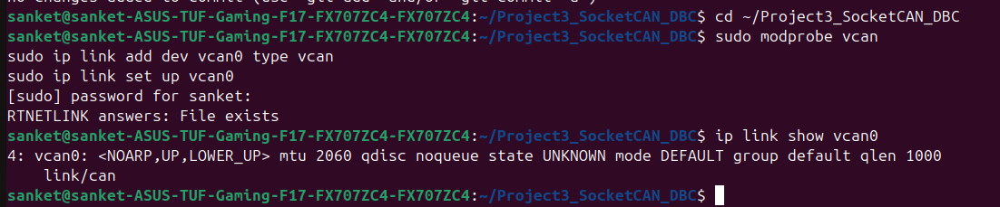

So GitHub should display the images, provided the filenames in your repository exactly match.

Your screenshot section is:

1_vcan0_setup.png ✅
2_project_build.png ✅
3_can_transmitter.png ✅
08a_raw_vs_decoded.png ✅
5_dbc_file.png ✅
6_dbc_validation.png ✅
7_dashboard.png ✅
08_raw_vs_decoded.png ✅
09_dbc_modification.png ✅
10a_ambient_temperature.png ✅
11_ai_dbc_generation.png ✅
12_ai_dbc_review.png ✅
10_overall_can_traffic.png ✅

Important: Paste it into GitHub without putting the README inside another code block. Then click Preview changes. The screenshots should appear as large images at the bottom.

If you want, I can also give you a shorter, professional GitHub README like your Battery Monitoring project, with the screenshots large at the end and less unnecessary text.
# Project Evidence and Screenshots

## 1. Virtual CAN Interface Setup


## 2. Project Build

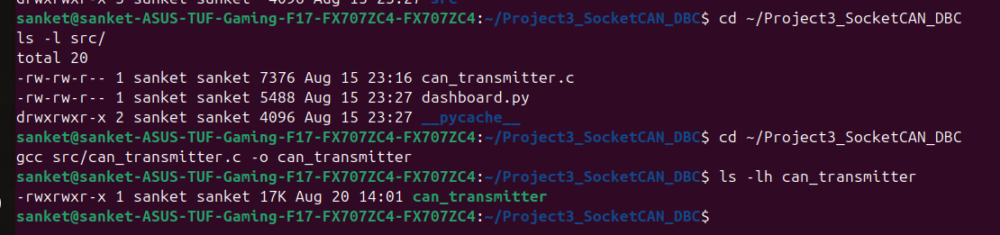

## 3. CAN Transmitter

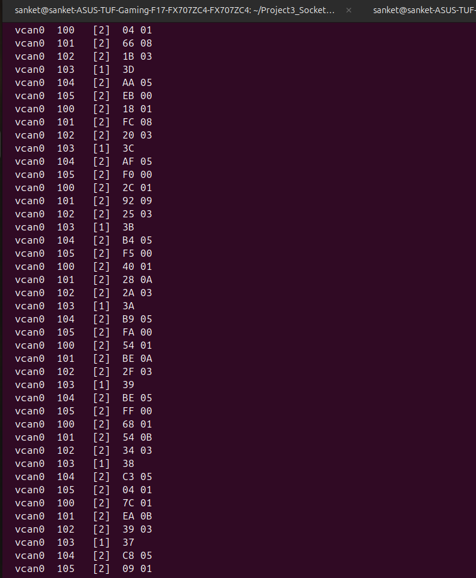

## 4. Raw CAN Traffic

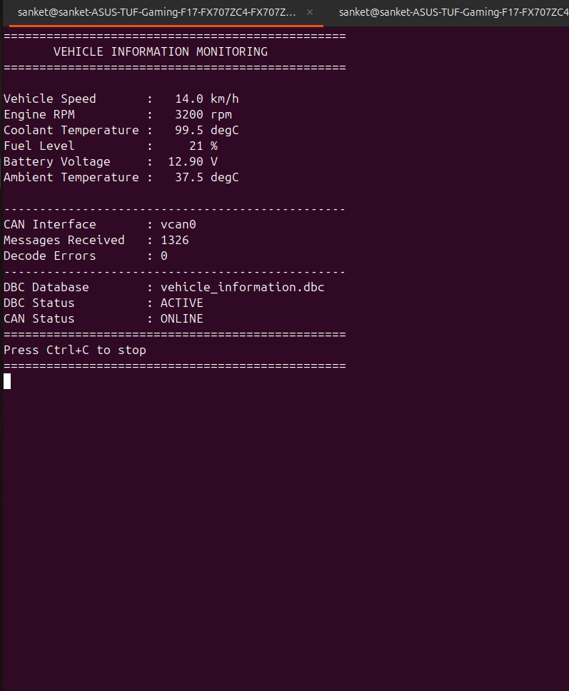

## 5. DBC File

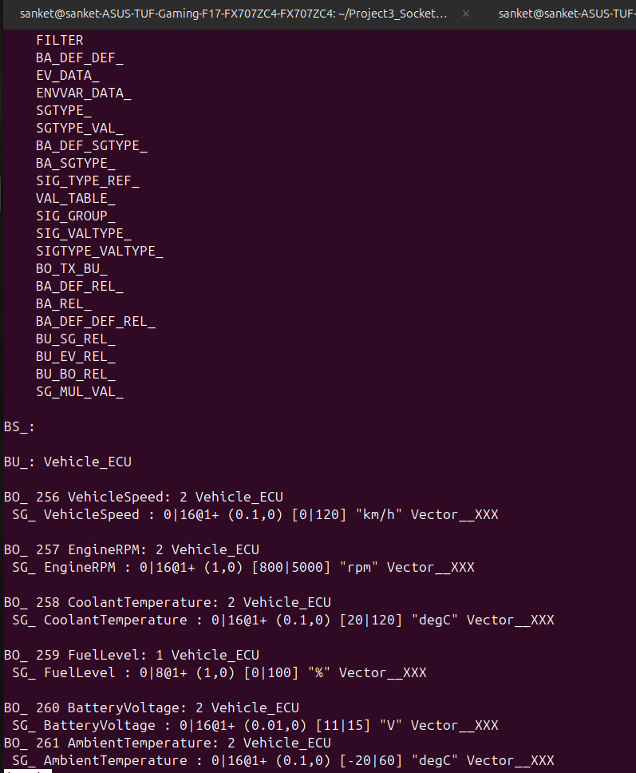

## 6. DBC Validation

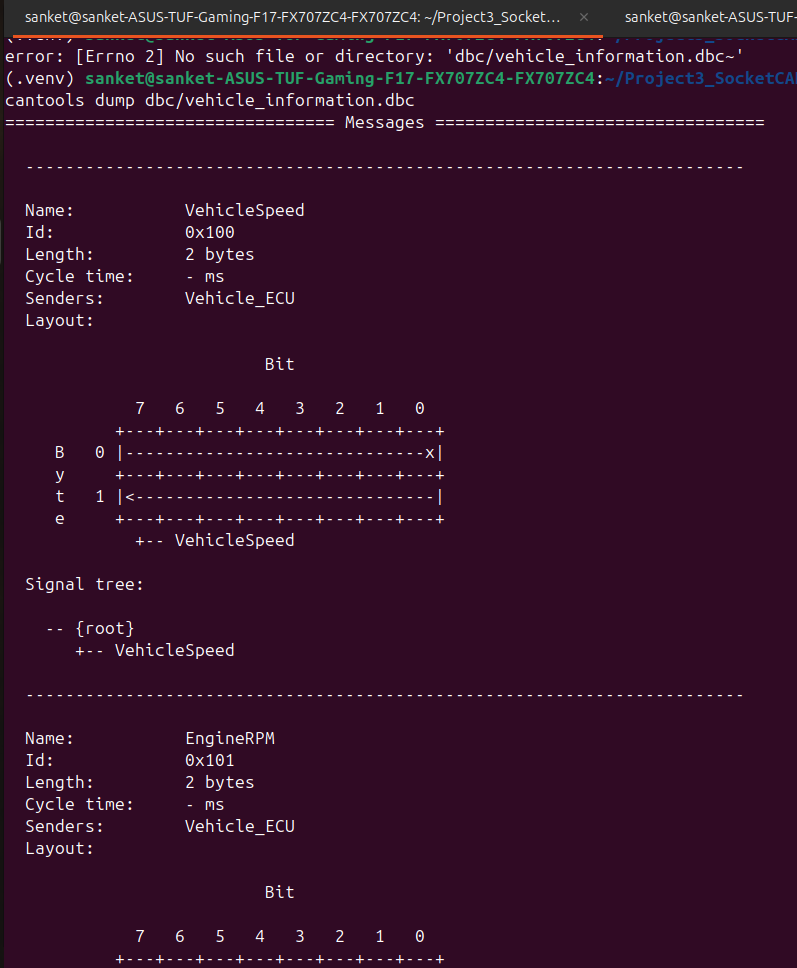

## 7. DBC Decoded Dashboard


## 8. Raw CAN vs Decoded Data

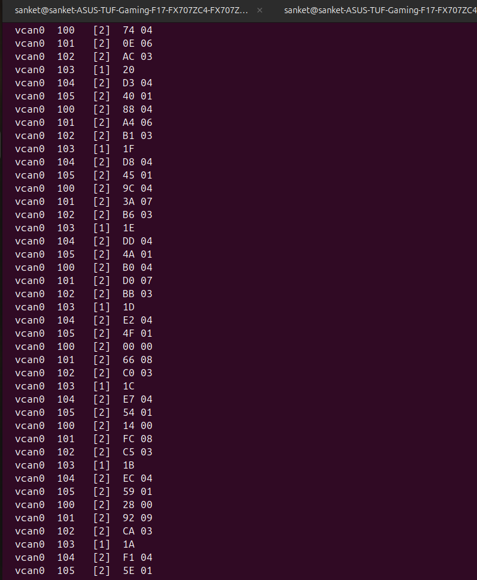

## 9. DBC Modification

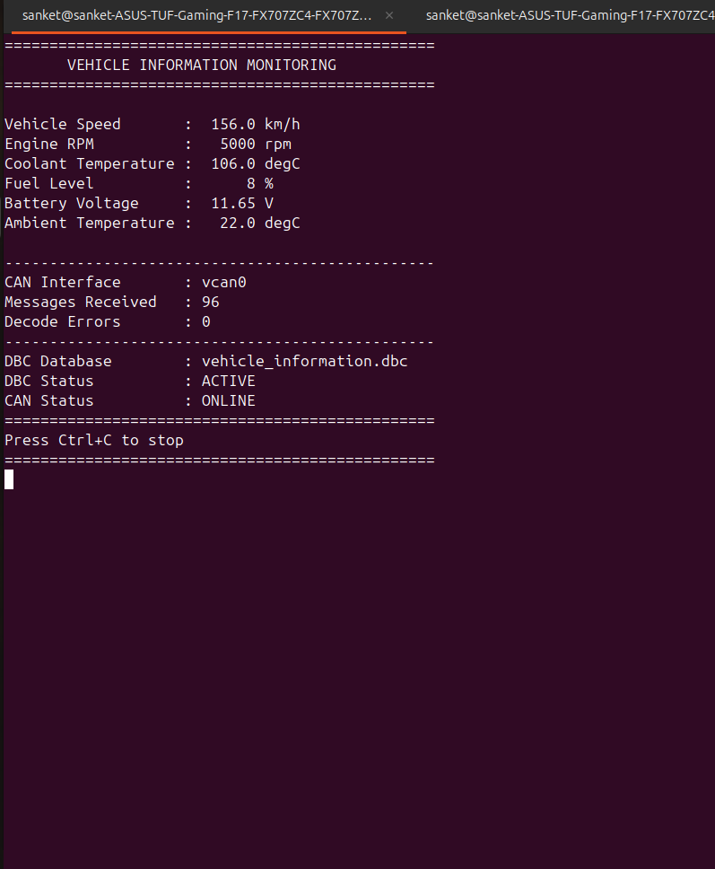

## 10. Ambient Temperature Signal


## 11. AI-Assisted DBC Generation

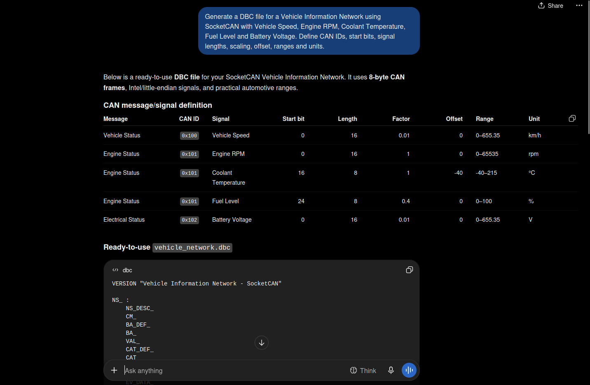

## 12. AI DBC Review

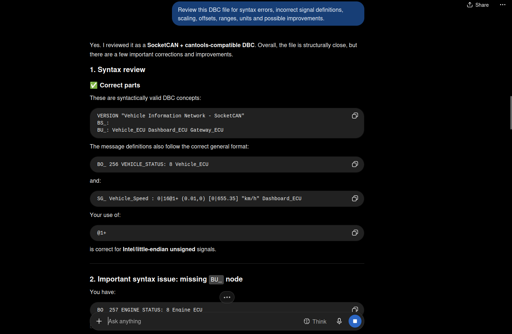

## 13. Overall CAN Traffic

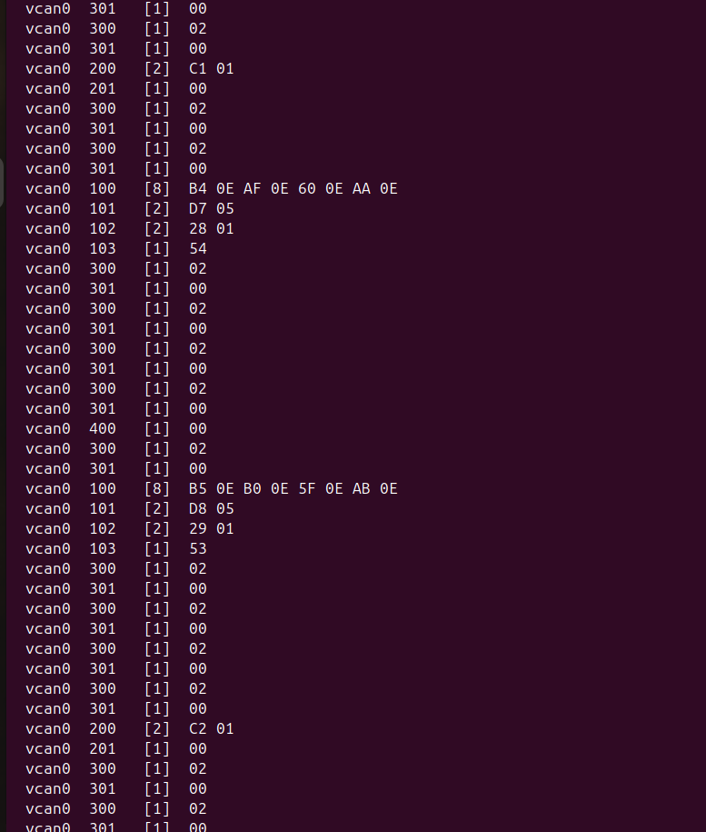
